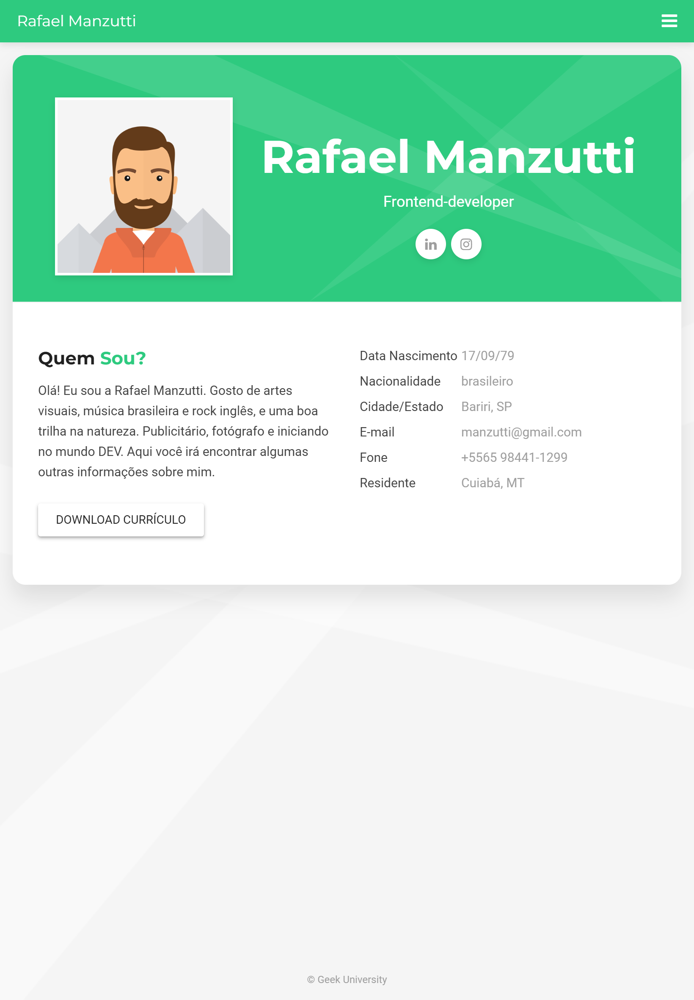

# Nome do seu projeto
> Um resumo curto sobre o que o seu projeto faz 1 ou duas linhas. "Projeto de e-commerce usando Python", por exemplo.

Um ou dois parágrafos sobre o seu projeto e o que ele faz.



## Instalação

OS X & Linux:

```sh
npm install --save
```

Windows:

```sh
edit autoexec.bat
```

## Exemplo de uso

Alguns exemplos que motivariam as pessoas a utilizarem seu projeto. Ou que demonstrem que seu proeto é útil para algo específico.
Divida em partes menores e se possível com partes de códigos ou prints de telas para exemplificar.
## Ambiente de desenvolvimento

Descrever como instalar e preparar qualquer dependência de desenvolvimento para que seu projeto possa ser executado localmente e pessoas possam contribuir com o mesmo. Se possível forneça as informações para diferentes plataformas. Como Windows, Linux e Mac OS.

## Histórico de Atualizações

* 0.2.1
    * CHANGE: Atualização dos docs (o código não foi alterado).
* 0.2.0
    * CHANGE: Removida a função `setPadraoXYZ()`
    * ADD: Adicionado a função `inicializar()`
* 0.1.1
    * FIX: Crash quando executava `escrever()` (Obrigado ao @contribuidor)
* 0.1.0
    * O Primeiro lançamento estável.
    * CHANGE: Renomeado de `Projeto XYZ` para `Projeto ABC`
* 0.0.1
    * projeto inicial.

## Meta

Rafael Manzutti - [@MeuInstagram](https://instagram.com/meuInstagram) - meuemail@gmail.com

Distribuído sobre a licença. Veja `LICENÇA` para mais informações.

[link projeto git hub](https://github.com/rafaelmanzutti/rafaelmanzutti.github.io)

